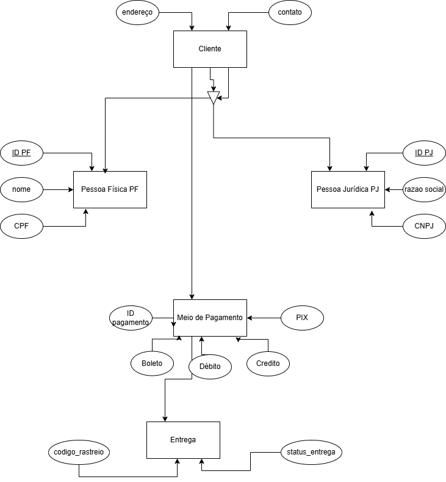

# Refinando um Projeto Conceitual de Banco de Dados - E-COMMERCE

Este repositório contém o desafio de projeto do curso de Banco de Dados da DIO. O objetivo é refinar um modelo conceitual de e-commerce atendendo a requisitos específicos.

## Objetivo
Refinar o modelo original acrescentando os seguintes pontos:
- **Cliente PJ e PF:** Uma conta pode ser PJ ou PF, mas não pode ter as duas informações simultaneamente.
- **Pagamento:** Possibilidade de cadastrar mais de uma forma de pagamento por cliente.
- **Entrega:** Inclusão de status e código de rastreio para o controle logístico.

## Conteúdo
- Arquivo do diagrama (PDF/Imagem)
- Descrição das entidades e relacionamentos

Detalhamento Técnico do Projeto
O modelo conceitual foi refinado para atender às necessidades de um sistema de E-commerce moderno, focando em integridade de dados e experiência do usuário.

1. Especialização de Cliente
Entidade Cliente: Centraliza informações comuns como endereço e contato.

PF e PJ: Aplicada a técnica de generalização/especialização. Um cliente é registrado como Pessoa Física (CPF) ou Pessoa Jurídica (CNPJ), garantindo que uma conta não possua ambos os tipos de identificação simultaneamente.

2. Gestão de Pagamentos
Meios de Pagamento: O sistema permite que um único cliente tenha múltiplas formas de pagamento cadastradas (Cartão de Crédito, Débito, Boleto, PIX), facilitando o checkout.

3. Logística e Entrega
Rastreabilidade: Cada entrega possui um codigo_rastreio único e um status_entrega (ex: Processando, Em Trânsito, Entregue), permitindo o acompanhamento em tempo real pelo cliente.

